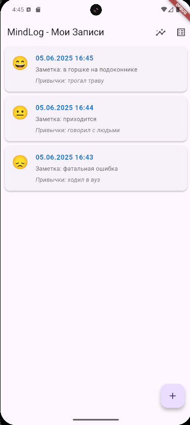

# MindLog: Персональный трекер настроения и привычек

**MindLog** — это мобильное приложение на Flutter. Оно помогает пользователям отслеживать свое ежедневное настроение, фиксировать выполнение привычек и получать простые инсайты о взаимосвязи этих факторов.


## Скриншоты





## Установка и запуск

для запуска на мобильном устройстве выполните следующие шаги:

1.  **Скачайте APK-файл:**
    *   Перейдите в раздел **[Releases](https://github.com/Chaberis/mindlog/releases)** нашего репозитория.
    *   Скачайте файл `app-release.apk` из последнего релиза.

Для запуска проекта на локальной машине выполните следующие шаги:

1.  **Клонируйте репозиторий:**
    ```bash
    git clone https://github.com/Chaberis/mindlog.git
    cd mindlog
    ```

2.  **Убедитесь, что у вас настроено окружение Flutter.**
    Если нет, следуйте официальной [инструкции по установке Flutter](https://flutter.dev/docs/get-started/install).

3.  **Установите зависимости проекта:**
    ```bash
    flutter pub get
    ```

4.  **Запустите приложение на эмуляторе или подключенном устройстве:**
    ```bash
    flutter run
    ```
---
